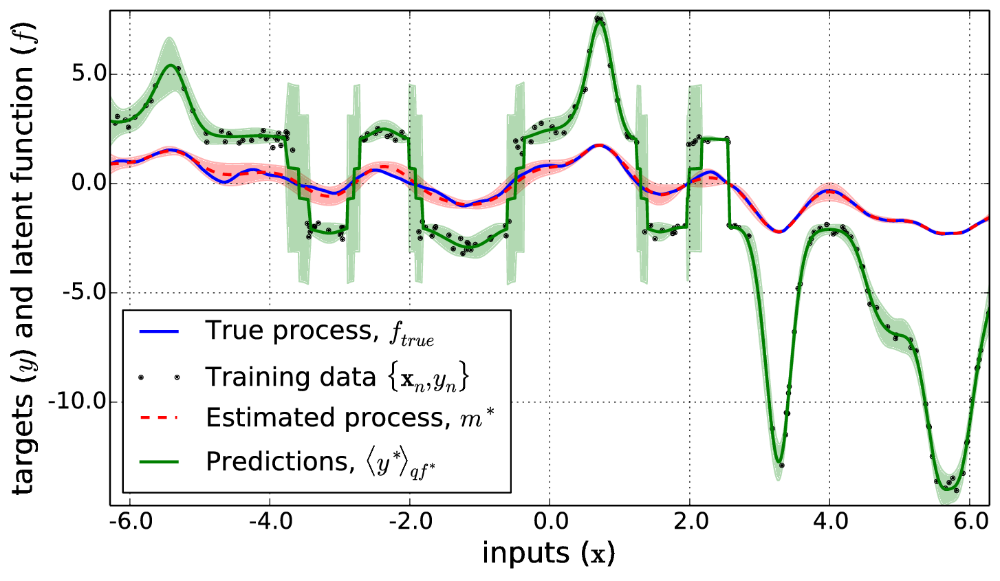
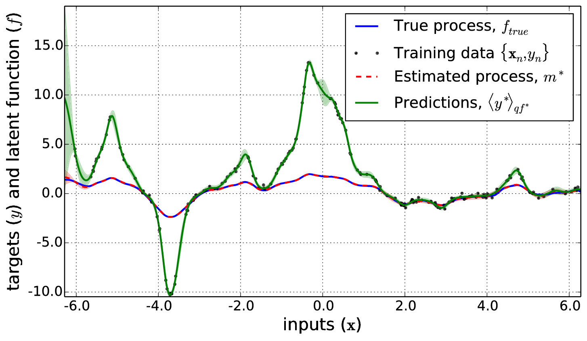

Extended and Unscented Gaussian Processes
=========================================

**Author**: [Daniel Steinberg](http://dsteinberg.github.io/)

**Date**: 31st Oct 2014

**Institution**: [NICTA](http://www.nicta.com.au)

**License**: LGPLv3, see COPYING and COPYING.LESSER for more information 

**Overview**:

This code contains **python** 2.7 and 3.x implementations of the Extended and
Unscented Gaussian Processes (E/UGPs) for inversion problems as described in
[1]. These are similar to regular GPs, but the latent function, **f** can
optionally have an extra nonlinear relationship to the observations, **y**, in
the likelihood,

* Normal GP likelihood: **y** ~ N(<b>f</b>, &sigma;<sup>2</sup>**I**) or for a
  single observation, *n*, y<sub>n</sub> = f<sub>n</sub> + &epsilon;. 
* E/UGP likelihood: **y** ~ N(*g*(<b>f</b>), &sigma;<sup>2</sup>**I**) or for a
  single observation, *n*, y<sub>n</sub> = *g*(f<sub>n</sub>) + &epsilon;

Where *g*(.) is an arbitrary scalar function (maps R to R). The posterior
Gaussian process parameters are learned using a variational objective with
Gauss-Newton style linearization (of *g*) and mean finding.

The extended GP uses a first order Taylor series expansion of *g* about the
*posterior mean* of the latent function (<b>f</b>) to obtain an approximate
posterior within the Gauss-Newton iterations. The unscented GP uses
*statistical linearisation*, specifically the unscented transform, to linearise
*g* about the posterior mean in the Gauss-Newton iterations. The EGP requires
derivatives d<i>g</i>/d<i>f</i><sub>n</sub> for the Taylor expansion, however
the UGP does not, and can be used on nonlinear functions that do not have
derivatives e.g.  signum functions,



NLopt gradient free methods (BOBYQA) uses free energy lower bound to optimise
kernel hyperparameters and &sigma;.

Also included in this repository are:
* A regular Gaussian process (as a working base class for the non linear
  methods).
* The experimental from [1] for both experiments:
    * The "toy" inversion problems
    * The USPS handwritten digits binary classification experiment 
    
You can obtain [1] from my [homepage](http://www.daniel-steinberg.info).


* * *


Table of Contents
-----------------

[Dependencies](#dependencies)

[Installation](#installation)

[Usage](#usage)

[Experiments](#experiments)

[References](#references)

[Acknowledgements](#acknowledgements)


Dependencies
------------

For the linearized GPs:
* Python 2.7 or 3.x (tested with 3.3)
* Scipy
* Numpy
* NLopt

For the tests:
* Matplotlib

For the classification experiment:
* Scikit-learn
* Octave (or Matlab for running the GPML classifiers)
* [GPMLtoolbox](http://www.gaussianprocess.org/gpml/code/matlab/doc/)
  (Matlab/Octave toolbox for the competing GP classification methods)

All of these should be packages on most major GNU/Linux distributions (I am
using Fedora) apart from the GPML toolbox, and should also be easily obtainable
with various scientific python packages for Windows and OS X (e.g. Anaconda,
Enthought Canopy, PythonXY, etc). 

**NOTE**: Make sure you use the correct libraries for python 2.7 or 3.x!


Installation
------------

A setup.py script has been provided which can be used with distutils,
easy_install and pip. It only checks for the scipy and numpy dependencies, so
you *will need to install the NLopt dependency before running this script*.
This is how you can download and install the code from github using pip,

```
git clone https://github.inside.nicta.com.au/SIEF/linearizedGP
cd linearizedGP
sudo pip install .
```

If you don't have pip, you can replace the last line with,

```
sudo python setup.py install
```

Where you should substitute the correct python/pip commands for the version of
python you are using (like `pip-python3` or `python3` depending on your OS).
If you don't want to run the experiments or tests, you do not need to keep the
code downloaded from github now.


Usage
-----

Once installed, this package can be imported as,

```python

# Import this package
from linearizedGP import extendedGP
from linearizedGP import unscentedGP
from linearizedGP import kernels

# Other imports for this example
import numpy as np
import scipy.linalg as la
```

Now let's make some example data

```python
# Some settings
N = 200         # training data
sigma = 0.2     # observation (Y) noise 
k_sigma = 0.8   # kernel amplitude
k_length = 0.6  # kernel length scale 

# A simple nonlinear function and its derivative 
nlfunc = lambda f: f**3 + f**2 + f
dnlfunc = lambda f: 3*f**2 + 2*f + 1

# Make a random draw from a GP
X = np.linspace(0, 10, N)  # Input observations
L = np.linalg.cholesky(kernels.kern_m52(X[:, np.newaxis,    # matern 5/2
                                        X[:, np.newaxis], 
                                        k_sigma,
                                        k_length))  # cholesky of a cov matrix

F = np.random.randn(N).dot(L)               # The "latent" function
Y = nlfunc(F) + np.random.randn(N) * sigma  # Target observations
```

Now that we have the data, we want to instantiate the GPs and also but bounds
on the kernel hyperparameters and likelihood noise,

```python

# Extended GP
egp = extendedGP.extendedGP(nlfunc, dnlfunc, kernels.kern_m52)
egp.learnLB((1e-1, 1e-1), ynoise=1e-2)  # establish lower bounds for NLopt 

# Unscented GP
ugp = unscentedGP.unscentedGP(nlfunc, kernels.kern_m52)  # no deriv required
ugp.learnLB((1e-1, 1e-1), ynoise=1e-2)  # establish lower bounds for NLopt 

```

Given the data and the bounds on the hyperparameters we can now learn the
values for the posterior parameters and hyperparameters (as long as we set some
initial values for the hyperparameters),

```python

# Extended GP
egp_objective = egp.learn(X, Y, kparams=(1.0, 1.0), ynoise=1.0, verbose=True)

# Unscented GP
ugp_objective = ugp.learn(X, Y, kparams=(1.0, 1.0), ynoise=1.0, verbose=True)

```

In both cases the objective function is the variational lower bound on
log-marginal likelihood (free energy). Now the learned parameters are in the GP
objects, e.g.,

```python

print(egp.m)
print(egp.C)
print(egp.kparams)
print(egp.ynoise)

```

We can use these trained GPs to predict new targets, Y\*, and latent functions
F\* given new test inputs, X\*.

```python

# Test data
Ns = 1000
Xs = np.linspace(0, 10, Ns)

# EGP prediction
EYs_e, VYs_e, EFs_e, VFs_e = egp.predict(Xs)  # This uses quadrature

# UGP prediction
EYs_u, VYs_u, EFs_u, VFs_u = ugp.predict(Xs)  # This uses the unscented tfm.

```

Where the expected values of Y\* and the latent function F\* are `EYs_` and
`EFs_` respectively. The variance of these predictions is given by `VYs_` and
`VFs_` respectively. Here is an example of the unscented GP applied to the this
polynomial nonlinear transformation,




Experiments
-----------

To run the experiments from [1], firstly make sure you have the
[dependencies](#dependencies) installed for the relevant experiments. I prefer
running python code from an [ipython](http://ipython.org) console, and the
following instructions will assume this is the case. 

Note that since we released the paper, we have changed the code slightly so
that you may not get the exact results we got in the paper. If you wish to get
the exact same results, make sure the initial guess at the posterior mean (m)
is all zeros instead of being randomly initialised (change lines 166 and 219 of
the EGP and UGP code respectively). We made this change because initialising m
as all zeros lead to some pathological errors for some forward models (like for
functions that have zero gradient at zero).


### Toy inversion experiments

Firstly, generate the data using the `experiments/datagen.py` script. This will
generate random data for all of the forward models in the paper and save them
as mat files in the `data` directory (thanks to
[socallaghan](https://github.com/socallaghan) for automating this). These files
can also be opened with Matlab and Octave.

Now to run the experiments, point the `dataset` variable in
`experiments/toytest.py` to the data you just generated (e.g.
`"data/expdata.mat"`), change the values of the `plot`, `saveresults` and
`dolinear` variables as you see fit (the `dolinear` variable toggles an extra
experiment for running a normal GP), then from the ipython console run,

```python
In [2]: run experiments/toytest.py
```

This should then display the results of 5-fold cross validation of the EGP and
UGP (and a linear GP if toggled) on predicting the generated data, as in [1].


### Classification experiment

Here are the steps to run this experiment:

1. Download and extract the USPS handwritten digit data from
   [here](http://www.gaussianprocess.org/gpml/data/). This includes the data as
   a .mat file and a script to subset the digits. 

2. I've written a helper script generates the subset used for the
   classification experiment in [1] called `experiments/makeUSPS35data.m`, copy
   this script to where you extracted this dataset, and run it from Octave or 
   Matlab (from the same directory). This creates a file called
   `USPS_3_5_data.mat`.

3. Make sure the `datapath` variable in `experiments/uspsbclass.py` points to
   the file you generated in step 2. Then simply run from the linearizedGP code
   directory,

```python
In [1]: run experiments/uspsbclass.py
```

4. To run the Octave/Matlab scripts for the GMPL algorithms, run the
   `experiments/uspsbclass.m` script, making sure `gpmlpath` and `datapath`
   point to the relevant places.


References
----------

**[1]** D. M. Steinberg, E. V. Bonilla. Extended and Unscented Gaussian
    Processes, Advances in Neural and Information Processing Systems (NIPS),
    Montreal, December 2014, [[PDF]](http://papers.nips.cc/paper/5455-extended-and-unscented-gaussian-processes).


Acknowledgements
----------------

This research was supported by the Science Industry Endowment Fund (RP 04-174)
Big Data Knowledge Discovery project.
